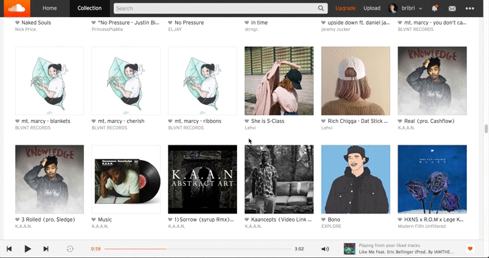

# soundclouddl
This is a chrome extension that downloads SoundCloud songs

Note: This extensions doesn't work for some songs and will provide an alert message if the download failed.

### How to use:
1. Right click on a soundcloud song
2. Click the 'Download SoundCloud Song' option in the context menu
3. Rename the file and save!

### Demo:

